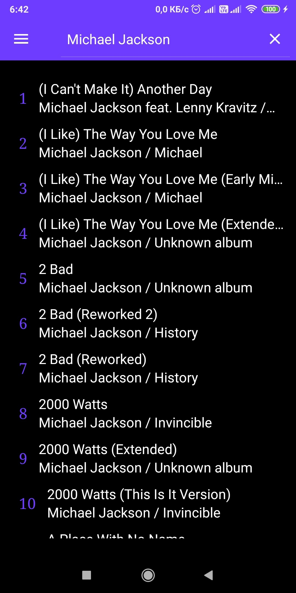
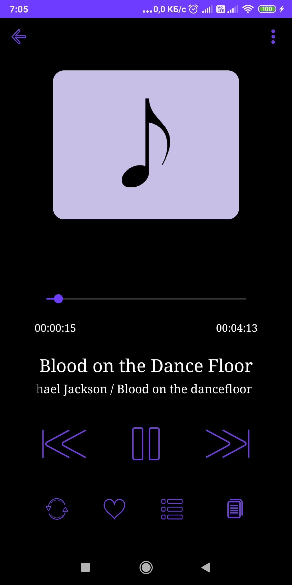
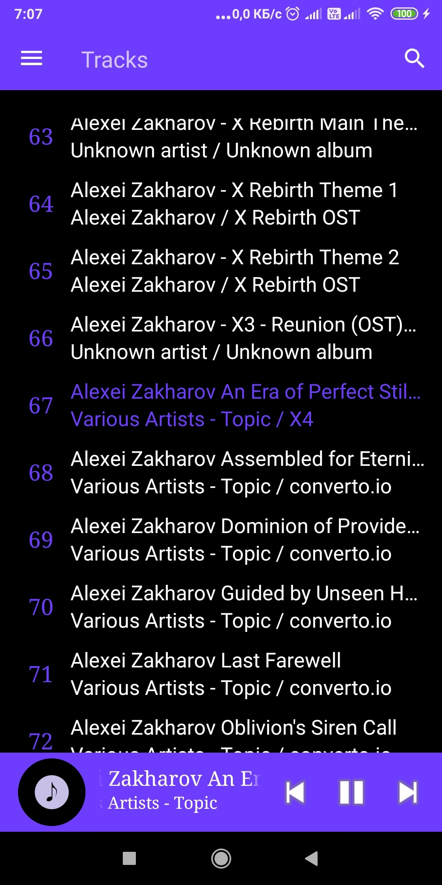
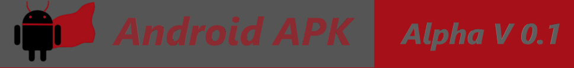

**Prima**
------------------------

**Developer**
------------------------
[Paranid5](https://github.com/dinaraparanid)

**Current status**
------------------------
**Alpha V 0.1**

**Install**
-----------------------

| **Download** |
|-|
| | 

**About App**
-----------------------

*Prima* is a muscip player android application. It is in a development process, but you can try it now! App is running any music file in your phone's storage.

**System Requirements**
-----------------------
*Android 6.0* or higher

**License**
-----------------------
**Apache License 2.0**