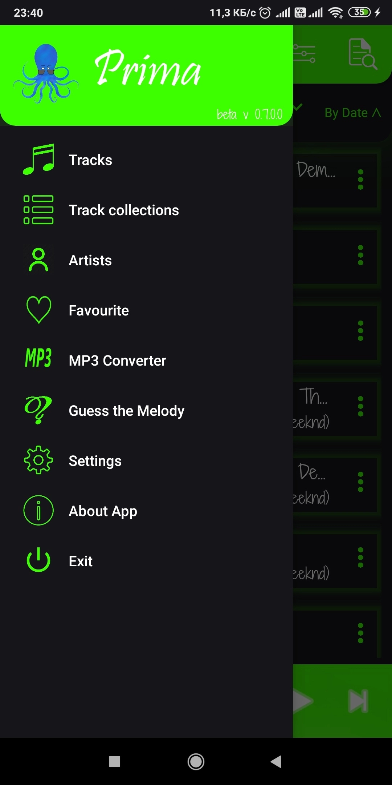
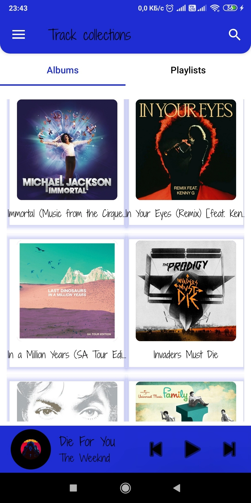
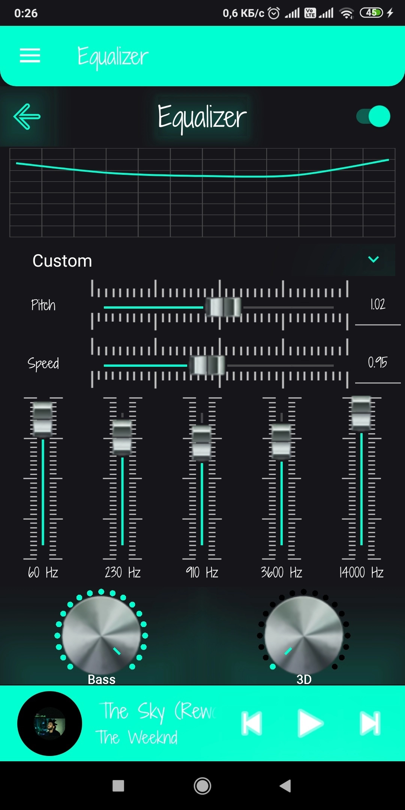
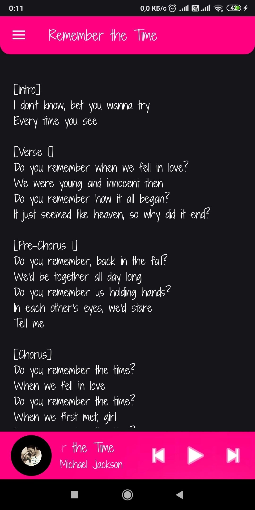
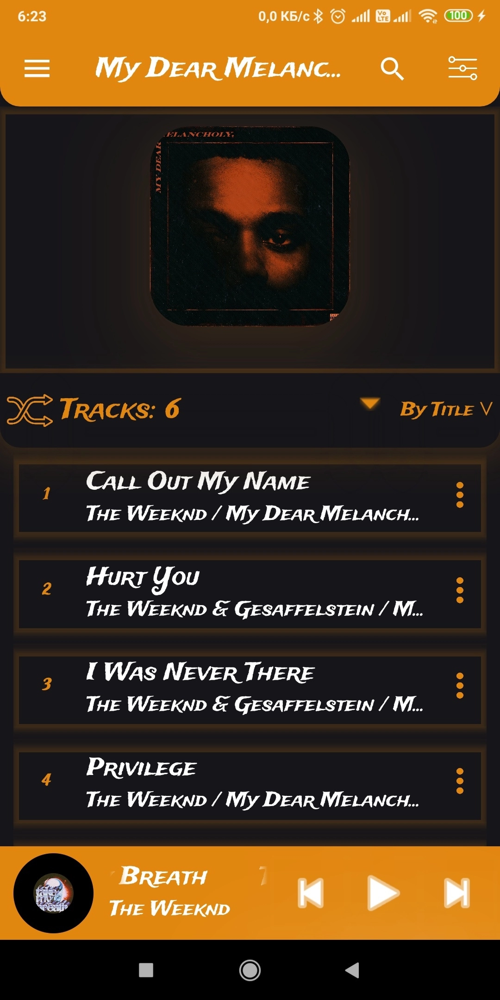
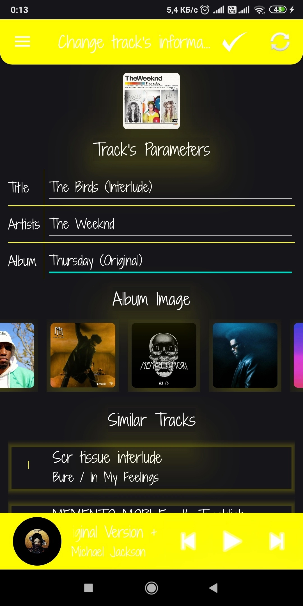
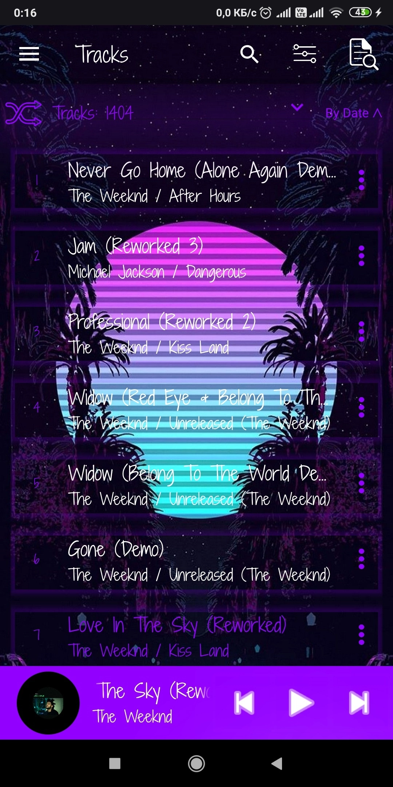
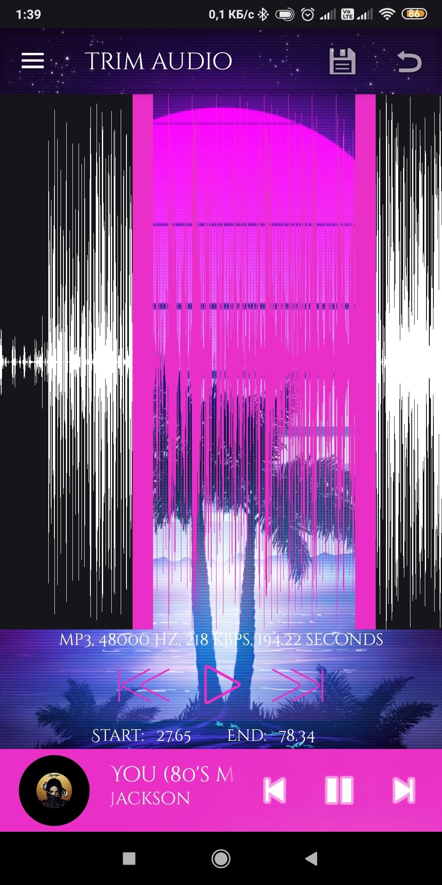
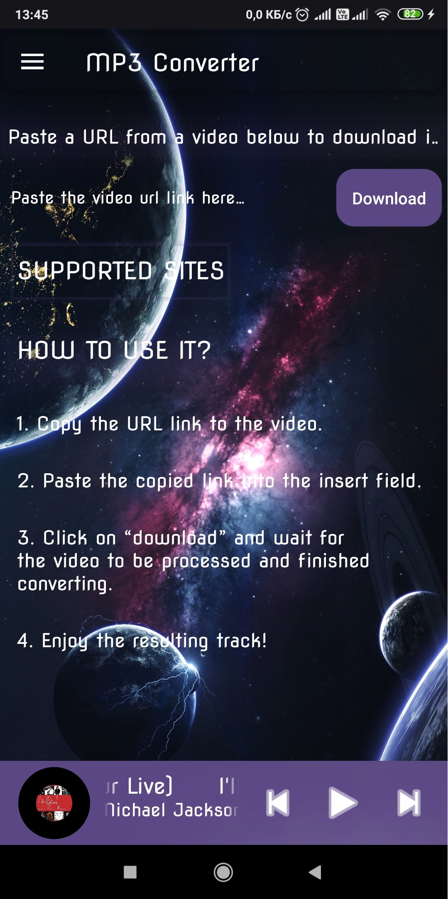

**Prima**
------------------------

**Developer**
------------------------
[Paranid5](https://github.com/dinaraparanid)

**Current status**
------------------------
**Beta V 0.6.1.0**

**Install**
-----------------------

| 

**About App**
-----------------------

**Prima** is an android music player *that works with tracks, artists and albums on your device*.
It supports a lot of file formats: from .wav to mp3.
Prima is fully customisable: you can choose language (**20 languages**), font (**near 100**) and **a lot of themes**. Prima gives access to Genius site with lyrics and info about tracks. Also you can convert any YouTube video to MP3 file (and not only YouTube). Prima has its own equalizer and audio trimmer. There are a lot of other cool features and there is no add or payment content :)

**System Requirements**
-----------------------
Android **6.0** or higher

**License**
-----------------------
*Apache License 2.0*
